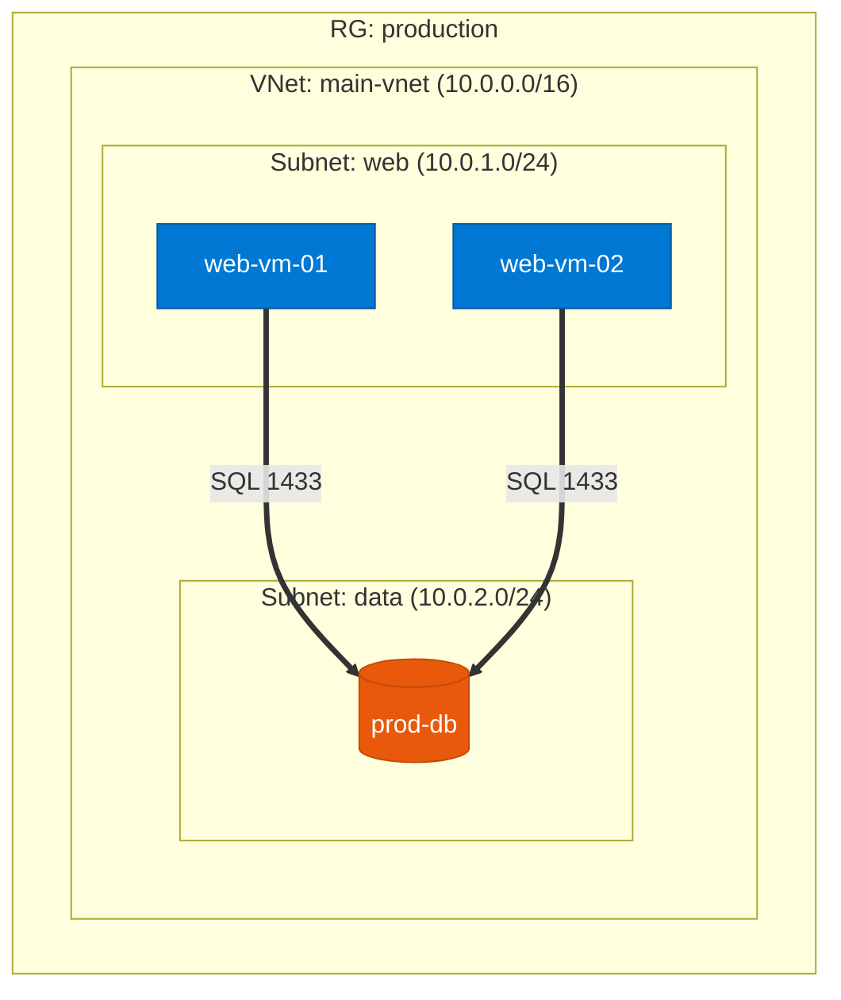

# Azure Architecture Diagram Generator

Automated tool that connects to your Azure environment, discovers all resources and their relationships, and generates professional architecture diagrams in **Lucidchart**, **Draw.io**, and **Mermaid** formats.

## Features

- **Auto-discovery** of Azure resources via Resource Graph KQL queries
- **Relationship inference** — VM→NIC→Subnet, LB→backends, Private Endpoints, VNet peering, NSG associations
- **Data flow analysis** from NSG rules, private endpoints, and service endpoints
- **4 diagram types**: High-level overview, Network topology, Application architecture, Data flow
- **3 output formats**: Lucidchart (.lucid + API upload), Draw.io (.drawio), Mermaid (.md)
- **Multi-subscription** support with tag and resource group filtering
- **Auto-layout** with hierarchical, flow, and grid algorithms

## Quick Start

### Prerequisites

- Python 3.11+
- Azure subscription with Reader role
- `az login` completed (or service principal configured)
- Lucidchart API key (optional, for Lucidchart output)

### Installation

```bash
pip install -e .
```

### Usage

**Discover + generate in one step:**

```bash
# Mermaid output (no API key needed)
azure-diagrammer run -s <subscription-id> -t all -f mermaid -o ./output/

# Draw.io output
azure-diagrammer run -s <subscription-id> -t network -f drawio -o ./output/

# Lucidchart output with upload
azure-diagrammer run -s <subscription-id> -t all -f lucidchart --upload -o ./output/
```

**Two-step workflow (discover, then generate):**

```bash
# Step 1: Discover and cache
azure-diagrammer discover -s <subscription-id> -o discovery.json

# Step 2: Generate from cache (fast, no Azure calls)
azure-diagrammer generate -i discovery.json -t network -f mermaid -o ./output/
```

### Diagram Types

| Type | Flag | Shows |
|------|------|-------|
| High-level | `--type high-level` | Subscriptions, RGs, resource counts |
| Network | `--type network` | VNets, subnets, peering, NSGs, LBs |
| Application | `--type app` | App tiers: Ingress → Compute → Data |
| Data flow | `--type dataflow` | Traffic flows from NSG rules, PEs |
| All | `--type all` | All of the above (multi-page) |

### Output Formats

| Format | Flag | Requires |
|--------|------|----------|
| Lucidchart | `--format lucidchart` | `LUCIDCHART_API_KEY` for upload |
| Draw.io | `--format drawio` | Nothing (open in diagrams.net) |
| Mermaid | `--format mermaid` | Nothing (renders in GitHub/docs) |

## Configuration

Copy `.env.example` to `.env` and configure:

```bash
cp .env.example .env
```

Key settings:

| Variable | Description | Default |
|----------|-------------|---------|
| `AZURE_SUBSCRIPTION_IDS` | Comma-separated IDs, or `all` | `all` |
| `LUCIDCHART_API_KEY` | Lucidchart API key for upload | — |
| `DEFAULT_OUTPUT_FORMAT` | `lucidchart`, `drawio`, `mermaid` | `lucidchart` |
| `INCLUDE_RESOURCE_GROUPS` | Filter to specific RGs | — |
| `EXCLUDE_RESOURCE_TYPES` | Exclude resource types | — |
| `FILTER_TAG` | Filter by tag (`key=value`) | — |

## CLI Reference

```
azure-diagrammer discover [OPTIONS]
  -s, --subscription    Subscription ID(s), or "all"
  -g, --resource-group  Filter to specific RG(s)
  --tag                 Filter by tag (key=value)
  -o, --output          Output path for discovery JSON
  -v, --verbose         Enable debug logging

azure-diagrammer generate [OPTIONS]
  -i, --input           Discovery JSON file (default: ./discovery.json)
  -t, --type            Diagram type (high-level|network|app|dataflow|all)
  -f, --format          Output format (lucidchart|drawio|mermaid)
  -p, --project         Project name for the diagram
  --upload              Upload to Lucidchart (requires API key)
  -o, --output          Output file or directory
  -v, --verbose         Enable debug logging

azure-diagrammer run [OPTIONS]
  (combines discover + generate — accepts all options from both)
```

## Project Structure

```
src/azure_diagrammer/
├── cli.py                  # CLI entry point (typer)
├── config.py               # Configuration & env vars
├── discovery/              # Azure resource discovery
│   ├── resource_graph.py   # Resource Graph KQL queries
│   ├── network_topology.py # Network Watcher topology API
│   ├── relationships.py    # Cross-resource relationship inference
│   └── data_flow.py        # NSG/PE/SE data flow analysis
├── model/                  # Internal graph model
│   ├── graph.py            # Nodes, edges, groups, pages
│   ├── azure_types.py      # Azure resource type → visual metadata
│   └── layout.py           # Auto-layout algorithms
├── renderers/              # Output format renderers
│   ├── lucidchart.py       # .lucid ZIP + REST API upload
│   ├── drawio.py           # Draw.io mxGraph XML
│   └── mermaid.py          # Mermaid flowchart markdown
└── templates/              # Diagram type templates
    ├── high_level.py       # Subscription/RG overview
    ├── network.py          # VNet/subnet topology
    ├── application.py      # App tier architecture
    └── data_flow.py        # Data flow visualization
```

## Development

```bash
# Install with dev dependencies
pip install -e ".[dev]"

# Run tests
pytest tests/ -v

# Run with coverage
pytest tests/ --cov=azure_diagrammer --cov-report=term-missing
```

## Example Mermaid Output



## Supported Azure Resource Types

30+ resource types mapped with display names, colors, and icons:

**Compute:** VMs, VMSS, App Services, Functions, AKS, Container Instances, ACR
**Networking:** VNets, Subnets, NICs, Public IPs, LBs, App Gateways, Firewalls, NSGs, Private Endpoints, VPN Gateways, ExpressRoute, DNS, Traffic Manager, Front Door, Route Tables
**Data:** SQL Server/DB, Cosmos DB, MySQL, PostgreSQL, Redis Cache
**Storage:** Storage Accounts
**Security:** Key Vault, WAF
**Integration:** Service Bus, Event Hub, Event Grid, API Management, Logic Apps
**Monitoring:** Application Insights, Log Analytics

## License

MIT
